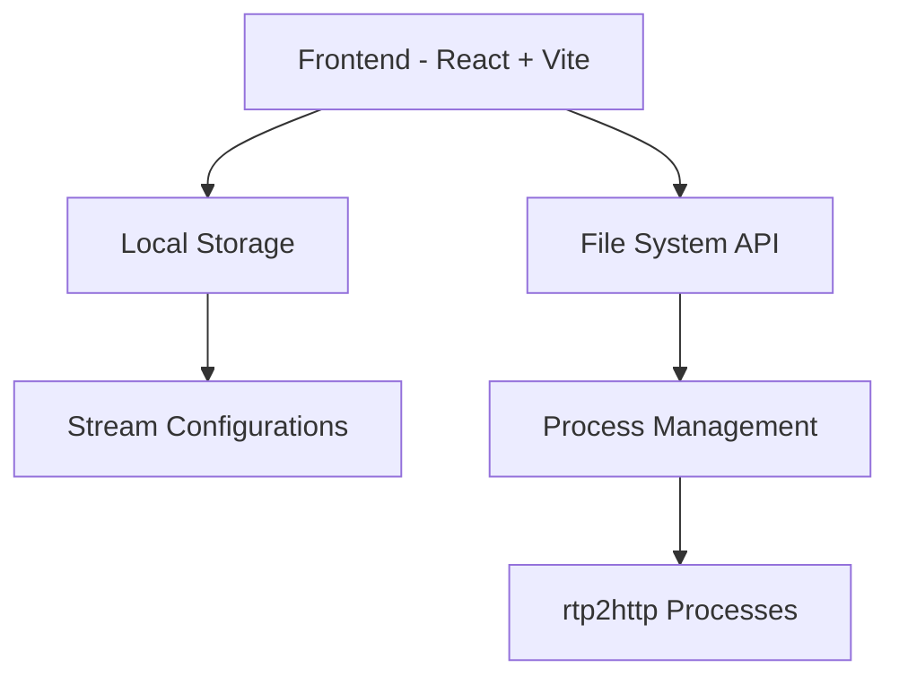
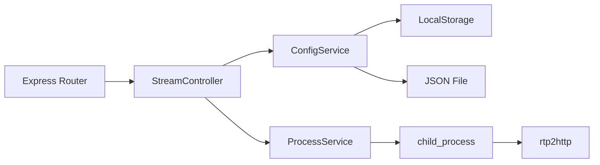
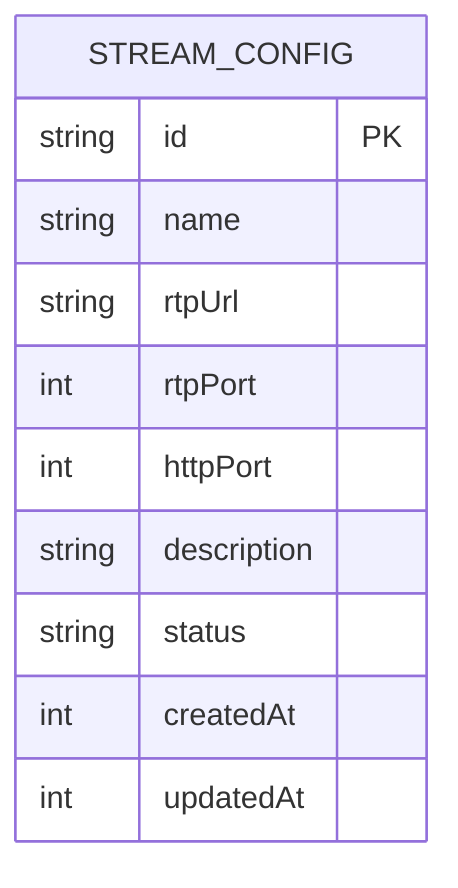

## 1. Architecture Design


## 2. Technology Description
- Frontend: React@18 + TypeScript + tailwindcss@3 + vite
- Initialization Tool: vite-init
- Backend: Express.js (轻量级本地服务器)
- Data Storage: LocalStorage + JSON 文件
- Process Management: Node.js child_process

## 3. Route Definitions
| Route | Purpose |
|-------|---------|
| / | 直播源列表首页 |
| /add | 添加新直播源 |
| /edit/:id | 编辑现有直播源 |

## 4. API Definitions
### 4.1 直播源配置 API
```typescript
interface StreamConfig {
  id: string;
  name: string;
  rtpUrl: string;
  rtpPort: number;
  httpPort: number;
  description?: string;
  status: 'stopped' | 'running';
  createdAt: number;
  updatedAt: number;
}

// 获取所有直播源
GET /api/streams → { streams: StreamConfig[] }

// 添加直播源
POST /api/streams, body: Omit<StreamConfig, 'id' | 'status' | 'createdAt' | 'updatedAt'> → { stream: StreamConfig }

// 更新直播源
PUT /api/streams/:id, body: Partial<StreamConfig> → { stream: StreamConfig }

// 删除直播源
DELETE /api/streams/:id → { success: boolean }
```

### 4.2 进程控制 API
```typescript
// 启动直播流
POST /api/streams/:id/start → { success: boolean, pid?: number }

// 停止直播流
POST /api/streams/:id/stop → { success: boolean }

// 获取直播流状态
GET /api/streams/:id/status → { status: 'stopped' | 'running', pid?: number }
```

## 5. Server Architecture Diagram


## 6. Data Model
### 6.1 数据模型定义


### 6.2 数据存储格式
```json
{
  "streams": [
    {
      "id": "1",
      "name": "主直播源",
      "rtpUrl": "239.0.0.1",
      "rtpPort": 5004,
      "httpPort": 8080,
      "description": "主要 RTP 直播源",
      "status": "stopped",
      "createdAt": 1716000000,
      "updatedAt": 1716000000
    }
  ]
}
```
