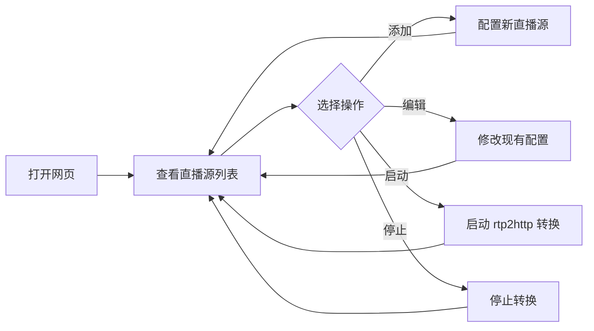

## 1. Product Overview
RTP2HTTP 直播源管理工具是一个本地网页应用，用于辅助用户管理 RTP 到 HTTP 的直播流转换。主要解决 RTP 直播源配置复杂、管理困难的问题，目标用户是需要管理多个直播源的技术人员或系统管理员。

## 2. Core Features

### 2.1 User Roles
| Role | Registration Method | Core Permissions |
|------|---------------------|------------------|
| Local User | 无需登录 | 完整的直播源管理权限 |

### 2.2 Feature Module
1. **直播源列表页**：查看、搜索、排序所有直播源
2. **直播源管理**：添加、编辑、删除直播源配置
3. **状态监控**：实时显示各直播源运行状态
4. **快捷操作**：启动、停止、预览直播流

### 2.3 Page Details
| Page Name | Module Name | Feature description |
|-----------|-------------|---------------------|
| 直播源列表页 | 搜索栏 | 支持按名称、地址搜索 |
| 直播源列表页 | 直播源卡片 | 显示名称、RTP 地址、HTTP 地址、状态 |
| 直播源列表页 | 操作栏 | 启动、停止、编辑、删除 |
| 添加/编辑页 | 配置表单 | 输入名称、RTP 地址、端口等参数 |

## 3. Core Process
用户打开网页 → 查看现有直播源列表 → 添加新直播源或管理现有源 → 启动/停止直播流转换 → 监控运行状态

## 4. User Interface Design
### 4.1 Design Style
- 主色调：深蓝色 (#1e3a8a)，辅助色：青色 (#06b6d4)
- 按钮风格：圆角方形，带有悬停和点击效果
- 字体：JetBrains Mono（代码字体）+ Inter（界面字体）
- 布局风格：卡片式布局，响应式网格
- 图标风格：简洁的线性图标

### 4.2 Page Design Overview
| Page Name | Module Name | UI Elements |
|-----------|-------------|-------------|
| 直播源列表页 | 头部 | Logo、标题、添加按钮 |
| 直播源列表页 | 搜索栏 | 搜索框、筛选按钮 |
| 直播源列表页 | 卡片网格 | 直播源卡片、状态指示器 |
| 添加/编辑页 | 表单 | 输入框、下拉选择、提交按钮 |

### 4.3 Responsiveness
桌面端优先，支持平板和移动设备自适应布局，触摸操作优化。
